### Web3 釣魚案例分析-代理智能合約型釣魚攻擊

🌐 **Web3 釣魚案例分析-代理智能合約型釣魚攻擊**

>上上章節說到精心策劃了（前戲）之後，這個章節要說的是點擊之後會有哪些攻擊手法。

#### 代理智能合約型釣魚攻擊詳述

1. proxy update

    攻擊者誘騙受害者簽署一個惡意的 Proxy 升級交易，
    這個交易將 Proxy 合約的實現合約更改為攻擊者控制的合約。 獲取控制權:攻擊者通過新的實現合約獲取 Proxy 合約的控制權。
    轉移資產:攻擊者使用這個控制權來轉移受害者的資產，如 NFT 和代 幣。

    補充：

    Proxy 合約主要功能
    1. 升級能力:
      代理合約(Proxy contract)允許指向不同的實 現合約(impl contract)，藉由僅更新實現合約升級而不影響至代理合約地址。

    2. 分離邏輯和數據:
      將業務邏輯 和數據存儲分離，業務邏輯在 實現合約中，數據存儲在代理
    合約中。

    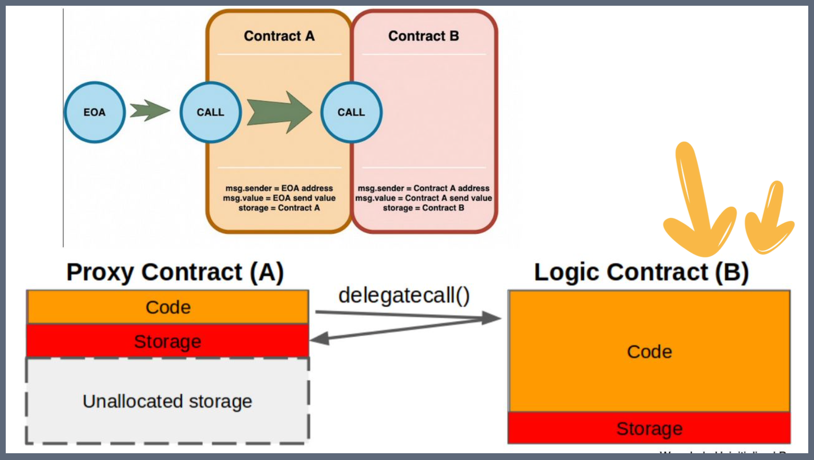

💥 攻擊手法：

也是個變形只是可能前面釣魚的樣子會不一樣例如說因要帶來更好的體驗，系統升級等等...

案例(一)
---

#### 2023 年 5 月 16 日，BlockSec 監測發現一種利用 OpenSea 協議代理（proxy）升级接口的新型釣魚騙局。

🔦 深入分析：

因為當使用者在 OpenSea 中建立帳戶時，平台會建立一個代理合約，並讓使用者將自己的 NFT 授權給該代理合約。基於此功能，騙局會讓受害者簽署  `uploadTo()` 函數，將 OpenSea 代理程式更改為其合約。更改實作後，攻擊者可以輕鬆呼叫 `multicall()` 並耗盡每個已核准的 NFT。

(目前只適用於 OpenSea 舊的協議，但也是一種攻擊要注意)

攻擊地址：
https://etherscan.io/tx/0x938363b2496d08b7e06b0c306b38def5d619817a5f972fc8076835b6781c5ae2

這邊建議可以看一下 DefiHackLabs 的小夥伴整理的整理可以很快了解

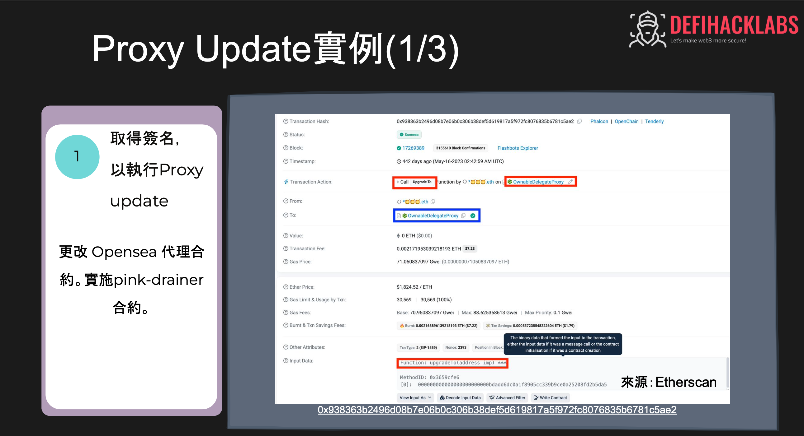
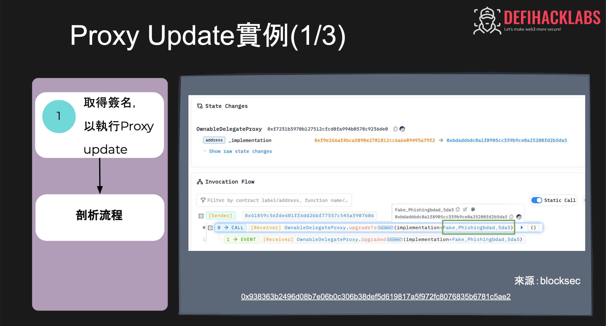
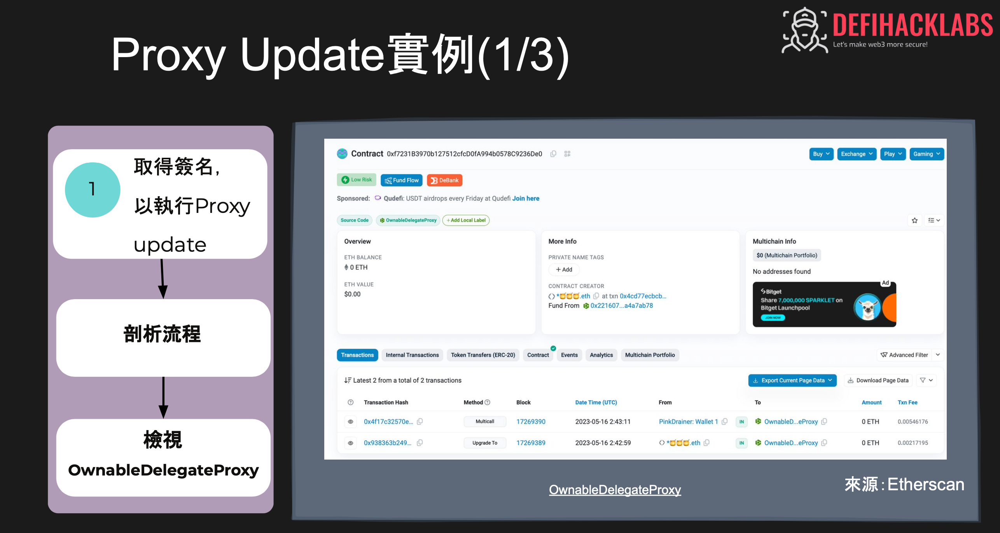
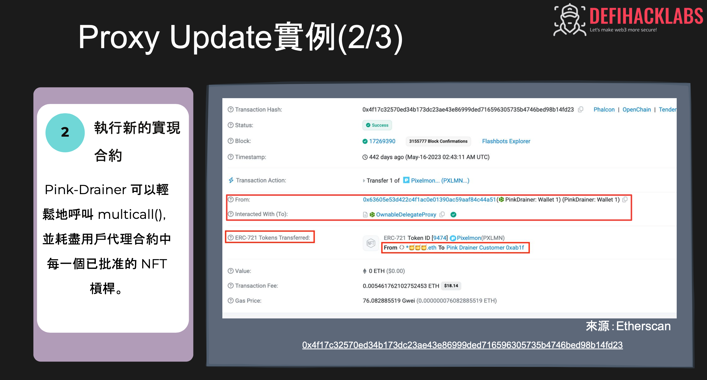
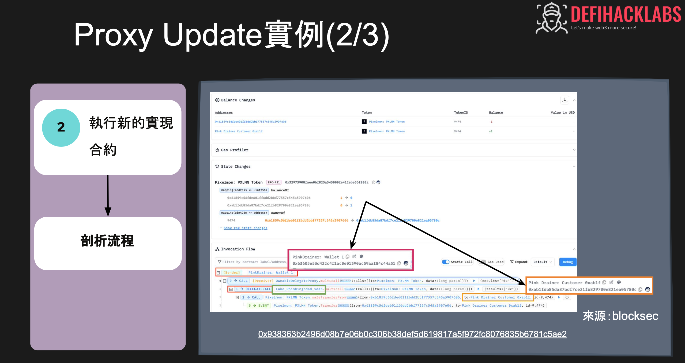
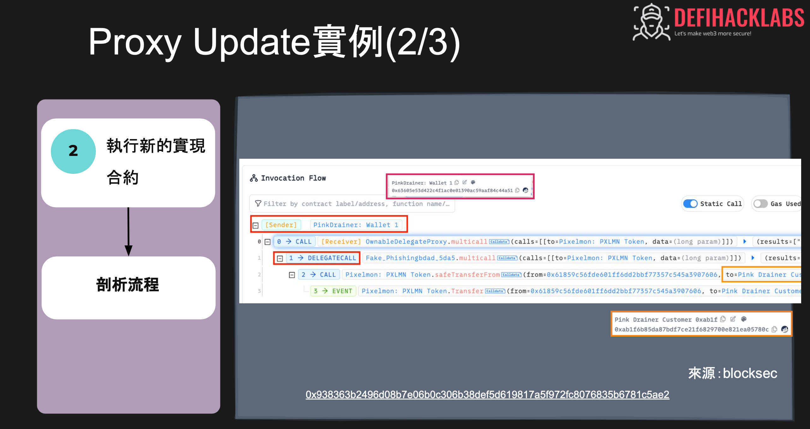
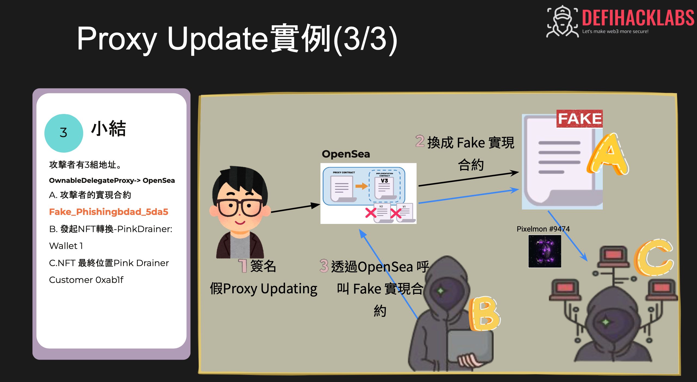

2.proxy

#### 假的  AAVE 代理合約升級。

🔦 深入分析：

  利用正經八百的畫面去誘騙使用者點選部署升級攻擊合約...

這邊也是引用 DefiHackLabs 小夥伴整理的流程給大家看一下

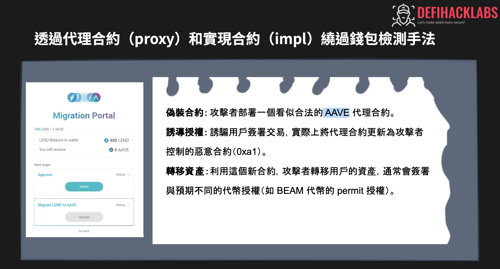
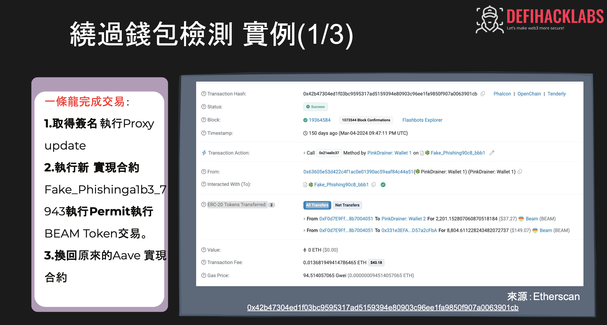
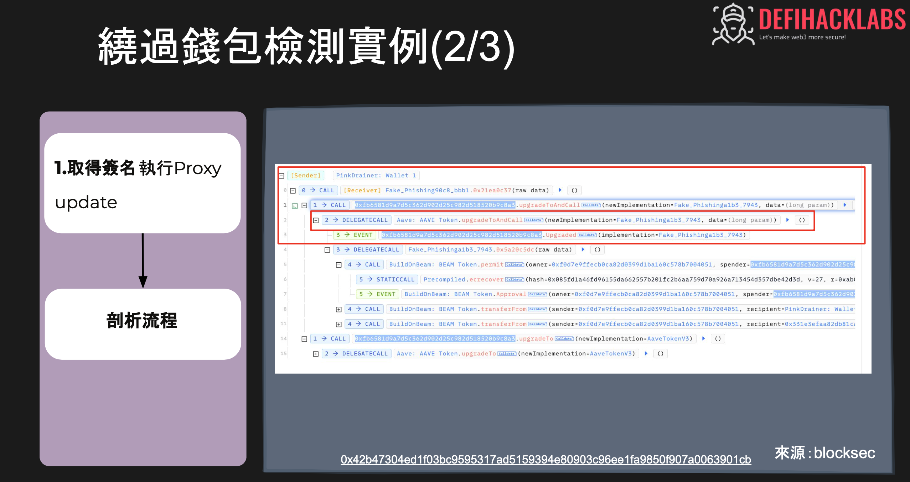
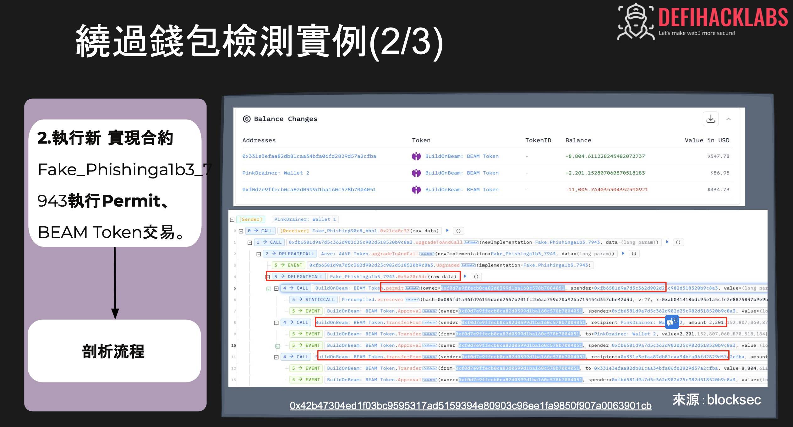
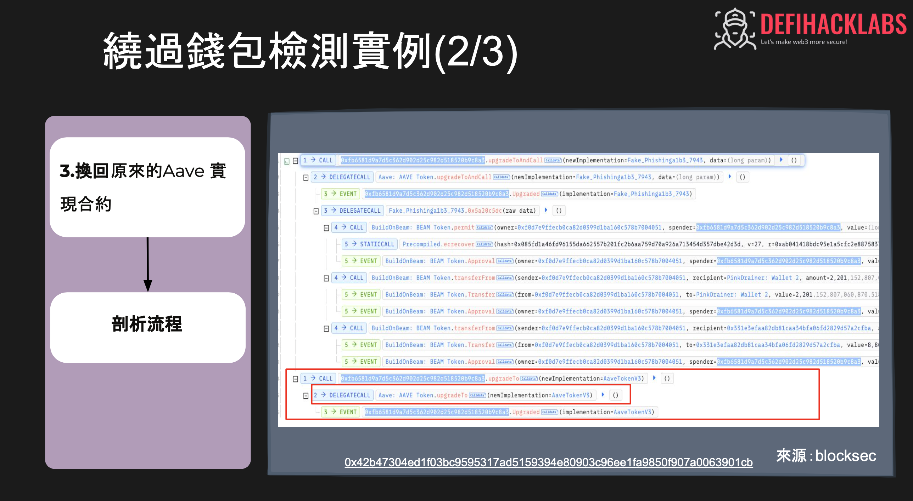
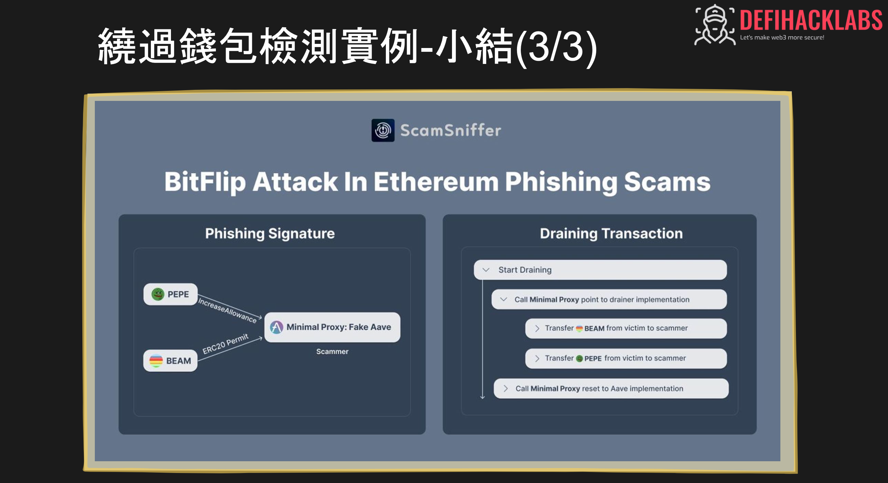

💡 **學習目標：**
- 理解進入釣魚環境中如何被代理智能合約型釣魚攻擊手法

💓❤🧡💛💚💙💜💖 感謝您的觀看。

🙏 敬請分享與訂閱

# 🙋‍♂️ 萬分感謝！👍👍👍

[上一章](./Day9-Web3%20釣魚案例分析(二).md) Day9-Web3 釣魚案例分析(二)

[下一章]()