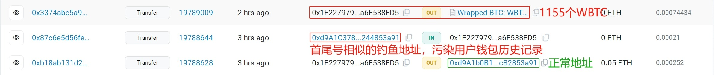
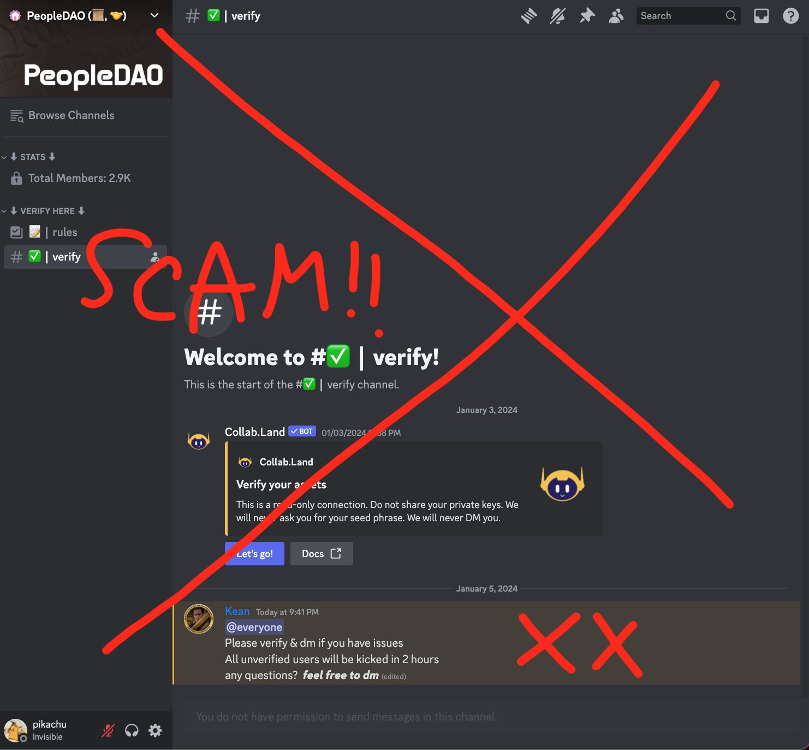

### Web3 釣魚案例分析-其他釣魚攻擊

🌐 **Web3 釣魚案例分析-其他釣魚攻擊**

>在前幾個章節明白，一些釣魚方式釣魚之後會有哪些交互，這裡再來看一些其他的方法和組合拳。

#### 其他釣魚攻擊攻擊詳述

1. 惡意預覽器插件


案例 (一)
---
#### 2024 年 3 月 1 日，據 X 用戶 Doom 反饋，其幣安帳戶存在異常情況，資金疑似被盜

一開始這個事件沒有引起太大關注，但在 2024 年 5 月 28 日，X 用戶 Tree 分析發現受害者 Doom 疑似安裝了一個 Chrome 商店中有很多好評的惡意 Aggr 擴充功能！它可以竊取用戶訪問的網站上的所有 cookies，並且 2 個月前有人付錢給一些有影響力的人來推廣它。


🔦 深入分析：

- 由 Aggr 擴充套件植入的惡意代碼，可以竊取用戶訪問的網站上的所有 cookies。
```
https://aggrtrade-extension.com/statistics_collection/index.php
就是一個使用應用程式順手傳送數據的網址...
```


可以多了解細節，這裡不再贅述。

[詳細解說來源](https://www.panewslab.com/zh/articledetails/sfzbzrr6.html)


2.其他釣魚攻擊


案例(一)
---
### 聲音合成詐騙騙局

🔦 深入分析：

李明和他的朋友王婷都是區塊鏈從業者，兩人經常透過微信探討區塊鏈項目。有一天，李明在微信上收到了「王婷」的語音，對方聲稱做專案遇到了緊急情況，急需 USDT 解決問題。在語音中，「王婷」表示自身 USDT 暫時用完了來不及兌換，請李明先轉部分 USDT 給她，並承諾事情解決後會立刻歸還。


[詳細解說來源](https://support.token.im/hc/zh-tw/articles/27885804563865-%E8%81%B2%E9%9F%B3%E5%90%88%E6%88%90%E8%A9%90%E9%A8%99-imToken-%E9%8C%A2%E5%8C%85%E5%AE%89%E5%85%A8%E6%9C%88%E5%A0%B1-22-%E6%9C%9F)


案例(二)
---
### 1155枚WBTC沒了！巨鯨誤轉「零U投毒攻擊」相似地址、損失超7200萬美元

🔦 深入分析：

1. 用戶正常轉帳的目標地址被釣魚團夥盯上，釣魚團夥提前碰撞生成了首尾號相似的釣魚地址，例如這裡是去除 0x 後的首4位、尾6位一樣。

2. 用戶正常轉帳時，釣魚立即（大概 3 分鐘後）尾隨一筆交易：釣魚地址往目標用戶地址轉了 0 ETH

3. 用戶習慣從錢包歷史記錄複製最近轉帳訊息，看到了這筆釣魚尾隨的交易，以為釣魚地址就是用戶正常轉帳的目標地址，於是複製出來

4. 最後，用戶可能會肉眼辨識目標位址的首尾號是否熟悉，可惜的是，此時的「目標位址」是使用者從錢包歷史記錄複製出來的釣魚位址，首尾號相同（首 4 尾 6 ） ，於是發起 1,155 枚 WBTC 的大額轉帳。

    

案例(3)
---
### NEO 創始人 Twitter 被盜，發送釣魚訊息

🔦 深入分析：

1. 7 月 6 日 23:30 收到一封要求重置密碼的電子郵件，在 50 分鐘後看到這封電子郵件時意識到 X 帳戶已被鎖定。

2. 駭客更改了其 X 賬號密碼，啟用了雙因素身份驗證，

3. 隨後開始發布包含詐騙鏈接的推文，

此次入侵是因為其之前將多個第三方網站 / 應用程序（辦公和日曆管理服務）連接到電子郵件。駭客以某種方式利用這些權限獲取對其電子郵件內容的讀取權限。


案例(4)
---
### Discord 釣魚攻擊

🔦 深入分析：

1.駭客在 X 上收集已經過期的 Discord 邀請鏈接
2.將他偽裝成釣魚的 Discord 服務，又使你點擊




還收集了一些文章，有興趣的可以看看：

[更多 Discord 攻擊手法] https://foresightnews.pro/article/detail/8685


[更多 Discord 攻擊手法實作] https://slowmist.medium.com/how-scammer-used-malicious-bookmark-to-gain-access-to-discords-of-nft-projects-7c3b325ff2e9


案例(5)
---
### TON 交易留言騙局

🔦 深入分析：

1. 這是一個 TON 有一個確認交易留言的功能，騙子利用這個功能，發送一筆交易，並在留言中寫上一個鏈接，讓用戶點擊。

2. 在 TON 轉帳中，您可以新增評論。

3. 然而，像 Tonkeeper 這樣的錢包會在簽名階段顯示評論——這些可能會產生誤導。

4. TON 網路釣魚網站使用針對每個網路釣魚活動量身定制的固定誤導性訊息。 🎣 


5.鏈上數據顯示，一個與詐騙相關的地址在短短幾天內就竊取了 22K TON。 🕵️‍♂️  💸 


案例(6)
---
### Daas 釣魚及服务

網路釣魚 目前的網路釣魚攻擊不再只是簡單的位址替換和網路釣魚網站。由於涉及的非法利潤極高，形成了一條完整的黑市產業鏈

🔦 深入分析：

1. `服務推廣`：Inferno Drainer 透過名為 Inferno Multichain Drainer 的 Telegram 頻道來推廣他們的服務，攻擊者也可以透過 Inferno Drainer 的網站存取該服務。

2. `建立釣魚網站`：攻擊者利用DaaS服務功能建立並產生自己的釣魚網站，並透過X（Twitter）、Discord等社群媒體進行推廣。

3. `誘導錢包連線`：誘導受害者掃描這些釣魚網站上的二維碼或使用其他方式連接錢包。

4. `發起惡意交易`：Drainer檢查受害者最有價值且最容易轉移的資產並發起惡意交易。

5. `受害者確認交易`：受害者確認這些交易。

6. `資產轉移`：資產轉移給犯罪者。被竊資產中，20%轉移給Inferno Drainer開發者，80%轉移給釣魚攻擊者。


Daas 後台服務畫面....


補充：
---
[Drainer 攻擊](https://share.foresight-news.com/article/detail/57545)

💓❤🧡💛💚💙💜💖 感謝您的觀看。

🙏 敬請分享與訂閱

# 🙋‍♂️ 萬分感謝！👍👍👍

[上一章](./Day10-Web3%20釣魚案例分析(三).md)
Day10-Web3 釣魚案例分析(三)

[下一章](./Day12.防禦%20Web3釣魚工具和心法.md)
Day12.防禦 Web3釣魚工具和心法

[返回目錄](./README.md)