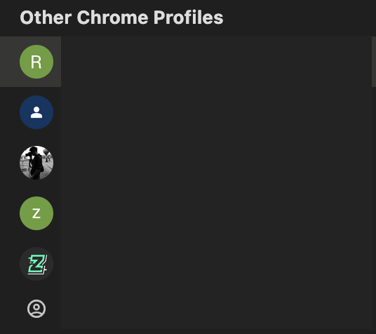

# 探索釣魚攻擊的演變：從 Web2 到 Web3 總結

🌐 **探索釣魚攻擊的演變：從 Web2 到 Web3**

寫到最後一天，整理了 Web2 -> Web3 的釣魚攻擊演變，希望大家能夠了解釣魚攻擊的演變，並且提高自己的防禦能力。

但就會是一個熟悉的場景(如下圖)

不管是 Web2 或 Web3，一定會有一個`假的場景讓你進入 🏠😛` （這個場景可能是以假亂真），特別要注意。

那會怎麼讓你進入呢？ 我整理了一下組合拳，希望大家能夠提高警覺。

1. 社群媒體＋釣魚貼文
2. 社群媒體＋社群留言＋釣魚留言
3. 社群媒體＋釣魚私訊
4. 某些駭客釣魚 Web2 服務後，再釣魚 Web3 服務
5. email+釣魚信
5. 釣魚 APP

    .... 真的太多了...

`對於釣魚者來說，只要有人點擊，就是他們的勝利，點擊操作後是他們的講理，所以我們要提高警覺`。

PS
- “釣魚”裡面通常就會附帶著釣魚 url
- 社群媒體
( X, Facebook, Telegram, Discord, Instagram, Reddit, Medium, LinkedIn, TikTok, Clubhouse, Snapchat, Pinterest, WhatsApp, WeChat, Line, Weibo, Douyin, Zhihu, etc.) 只要可以貼超連結的地方都是

所以下面說一下習慣或如果真的發生了，該怎麼辦。

### 習慣

- 習慣檢查 url
  可利用 [Day5 的工具](./Day5-防禦Web2%20網路釣魚檢測工具和技術.md)
- 沒有 https 的網站，不要輸入任何個人資料，或點擊動作。
- 所有的操作可以慢就慢有確認就要放慢

- `將錢包分類`
  - 常交互的錢包（就是常常在DeFi 或 協議上操作的錢包）（熱錢包）
  - 未知的項目使用新的錢包
  - 不太會動的資產（大資金）（冷錢包）

- `建議 chrome 開多使用者來建立錢包`

  

- 多訂閱資安新聞和相關訊息
    - https://github.com/SunWeb3Sec/DeFiHackLabs 🔴
    - https://x.com/evilcos 🔴
    - https://www.ithome.com.tw/security  🔴
    - https://www.securityweek.com/
    - https://www.securitymagazine.com/
    - https://cyware.com/cyber-security-news-articles/
    - https://hacked.slowmist.io/zh/  🔴
    - https://x.com/CertiKAlert
    - https://x.com/buaqbot 🔴

- 每天看一下資安新聞 3~5 秒也ＯＫ，慢慢的就會形成概念。

### 真的發生了，該怎麼辦？

# 切記一定要心平氣和的處理，不要慌張。

- 止損第一

  釣魚的當下，減小損失，是第一守則，如果資產還沒被轉走可以趕快移動到其他的地方。（Dex, Cex, 硬件錢包, etc.）

- 保護當下狀況

  如果有授權的取消授權，或找專業的人員幫忙。

- 分析原因

  不管是怎樣不要一直自責（悲傷的情緒），想一下最近或之前有沒有操作什麼動作記錄下來，以便之後的分析，下一次就不會再犯。

- 追蹤朔源

  區塊鏈的好處就是可以追蹤，可以看交易紀錄，可以看後續的走向提供給相關的單位。

- 結案

補充（很建議大家看一下大佬提供的手冊）：

[区块链黑暗森林自救手册](https://github.com/slowmist/Blockchain-dark-forest-selfguard-handbook/blob/main/README_CN.md)

---

💓❤🧡💛💚💙💜💖 感謝您的觀看。

🙏 敬請分享與訂閱

# 🙋‍♂️ 萬分感謝！👍👍👍

[上一章](./Day12-防禦%20Web3釣魚工具.md) Day12-防禦 Web3 釣魚工具

[返回目錄](./README.md)