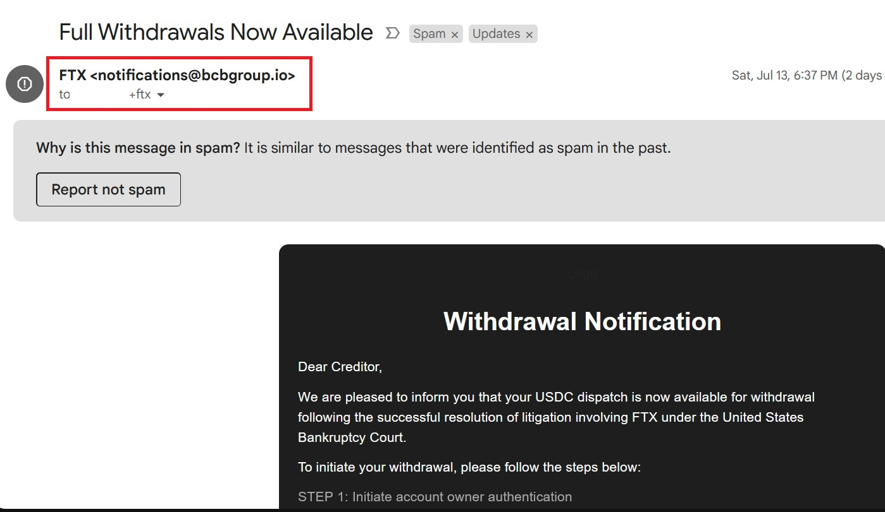

### 識別 Web2 魚叉式網路釣魚

🌐 **識別 Web2 魚叉式網路釣魚**

今天我們將學習如何識別可疑的魚叉式網路釣魚郵件和鏈接。這些技能將幫助你在面對潛在的網路威脅時做出明智的判斷，避免成為魚叉式網路釣魚攻擊的受害者。

📚 **課程內容詳細說明：**

#### 1. 識別 Web2 魚叉式網路釣魚郵件和網站
- **識別魚叉式網路釣魚郵件**
  - **發件人地址**：檢查郵件發件人地址是否可疑，是否與官方地址不符。注意發件人地址中的微小拼寫錯誤或變體。

    Example:
    
    合法的公司域名可能是 @company.com，而釣魚郵件可能會使用類似但不同的域名如 @c0mpany.com。
    
    如下圖所示，發件人地址中的拼寫錯誤可能是一個警告信號。但 gmail 會自動將這些郵件標記為不安全。

    Example:
    

  - **郵件內容**：注意郵件中是否包含緊急或誘導性語言，要求你立即點擊鏈接或提供個人信息。

    Example:
      - 帳戶緊急通知 🚧
      - 中獎通知 🎉
      - 偽裝成信任的聯絡人或公司 🏦
  - **格式和語法**：魚叉式網路釣魚郵件通常包含語法錯誤、拼寫錯誤或不合適的格式，因為很多時候都是用自動翻譯生成的。

  - **附件和鏈接**：避免打開不明附件或點擊郵件中的鏈接，特別是來自未知發件人的郵件。

- **檢查鏈接的安全性**
  - **懸停檢查**：在點擊鏈接之前，將鼠標懸停在鏈接上方，查看實際的 URL 是否與顯示的文本匹配。
  - **網址結構**：注意 URL 中是否有不正常的字符、拼寫錯誤或不熟悉的域名。
  - **HTTPS**：確保訪問的網站使用 HTTPS 協議，並檢查瀏覽器地址欄中的安全鎖圖標。
  - **觀看網站樣式**：注意網站的設計和風格是否與正確的網站相符，是否有錯誤或不一致的地方。

- **使用工具和技術識別魚叉式網路釣魚網站**
  - **瀏覽器安全功能**：使用現代瀏覽器的內置安全功能來檢測和警告可疑網站。
  - **第三方安全工具**：使用反魚叉式網路釣魚插件或軟體來幫助識別和阻止魚叉式網路釣魚網站。
  - **在線檢查**：使用在線工具（如 VirusTotal）掃描可疑鏈接或附件。

💡 **學習目標：**
- 掌握識別魚叉式網路釣魚郵件的方法。
- 學會檢查鏈接的安全性。
- 使用工具提高識別魚叉式網路釣魚網站的能力。

---
🔗 **相關連結：**
  - 檢測鉤魚郵件的工具

      #### PhishTank
      PhishTank 是一個協作平台，用戶可以提交和驗證鉤魚網站。您可以使用該平台來查找和驗證可疑的鉤魚郵件和網站。
      [PhishTank](https://www.phishtank.com/)

      #### Gmail 和 Outlook
      現代電子郵件服務提供商如 Gmail 和 Outlook 都有內置的鉤魚檢測功能，可以自動過濾和標記鉤魚郵件。

      #### SpamTitan
      SpamTitan 是一種企業級反垃圾郵件和鉤魚郵件過濾解決方案，提供高效的鉤魚郵件檢測和過濾功能。
      [SpamTitan](https://www.spamtitan.com/)

      #### Proofpoint Email Protection
      Proofpoint 提供高級的電子郵件安全解決方案，可以檢測和阻止鉤魚郵件、惡意軟體和垃圾郵件。
      [Proofpoint](https://www.proofpoint.com/us/products/email-protection)

      #### VirusTotal
      VirusTotal 是一個免費服務，允許您掃描可疑文件和網址以檢測病毒、蠕蟲、木馬以及各種惡意軟體，包括鉤魚郵件中的惡意鏈接。
      [VirusTotal](https://www.virustotal.com/)

- 檢測鉤魚網站的工具

  #### Google Safe Browsing
  Google Safe Browsing 是一項免費服務，保護用戶免受鉤魚網站和惡意網站的攻擊。您可以通過 Google Safe Browsing API 檢查可疑網址。
  [Google Safe Browsing](https://safebrowsing.google.com/)

  #### McAfee SiteAdvisor
  McAfee SiteAdvisor 提供網站安全評級，幫助用戶識別鉤魚網站和其他不安全的網站。
  [McAfee SiteAdvisor](https://www.mcafee.com/consumer/en-us/store/m0/catalog/mss.html)

  #### Netcraft Extension
  Netcraft 提供瀏覽器擴展，幫助用戶檢測鉤魚網站，並提供網站信譽評級和其他安全信息。
  [Netcraft](https://www.netcraft.com/)

  #### URLVoid
  URLVoid 是一個在線服務，可以分析和檢查可疑的網址，提供有關網站安全性、聲譽和歷史記錄的信息。
  [URLVoid](https://www.urlvoid.com/)

  #### OpenDNS PhishTank API
  OpenDNS 提供的 PhishTank API 可以用來檢查和識別鉤魚網站，提供實時的鉤魚檢測服務。
  [OpenDNS PhishTank API](https://www.opendns.com/phishing/)

