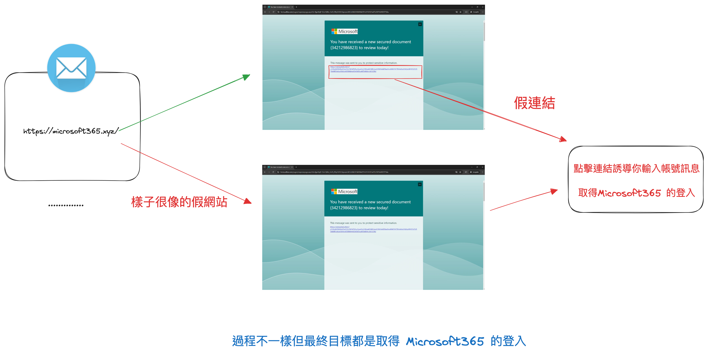
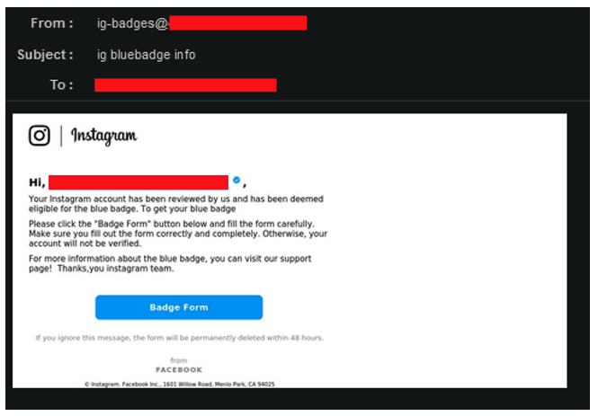
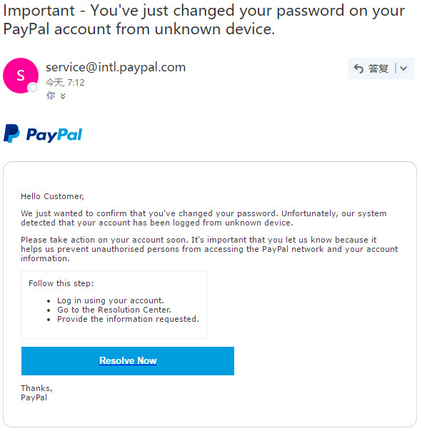
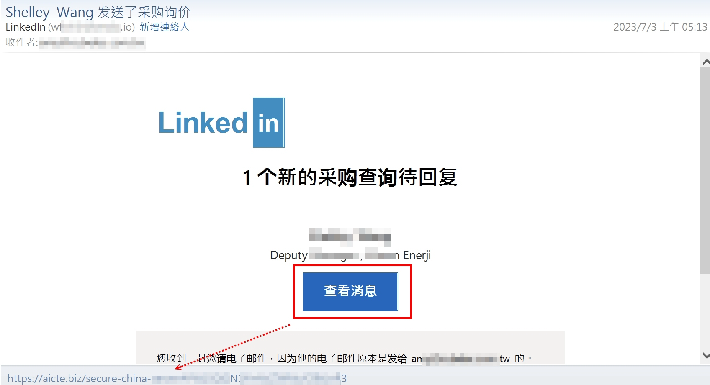
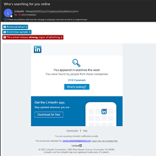
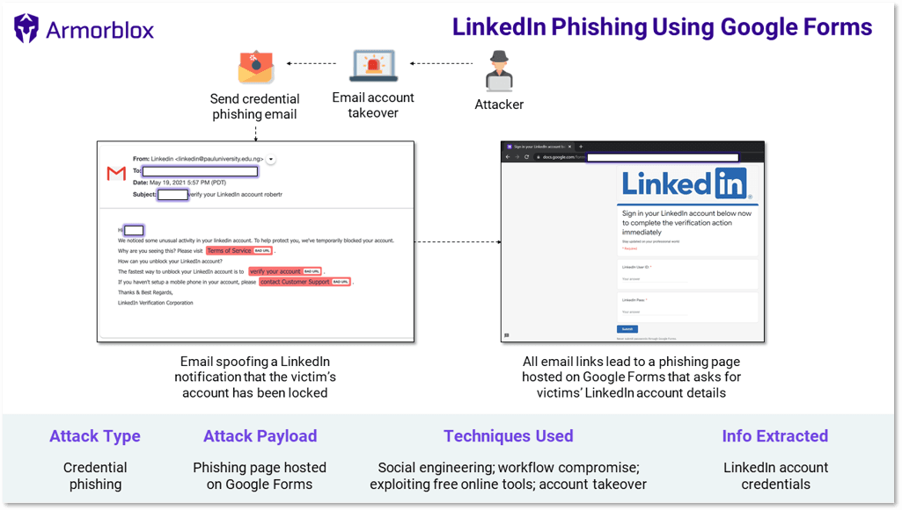
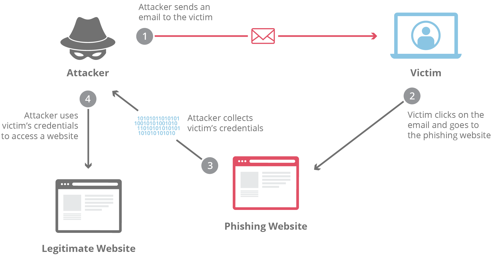

### 案例研究

今天我們將分析具體的 Web2 釣魚攻擊案例。這些案例將幫助你更好地理解釣魚攻擊的實際操作和防範措施。

📚 **課程內容詳細說明：**

#### Web2 釣魚攻擊案例研究

## 案例一：Microsoft 365 用戶成為濫用 Microsoft Forms 的釣魚攻擊目標

黑客可能透過，過去已經被駭客取得過資料中取得 e-mail 隨機發放此信件，並使用一些文宣讓使用者點入連結去填寫，表單中還挾帶著釣魚的網址，讓你好像要登入後才能完成表單，完成事情。

攻擊手法：

目標：取得Microsoft 365 登入的授權

影響：
  用戶的 Microsoft 365 帳戶被盜用，資料被竊取，
  駭客可以進一步利用這些帳戶進行詐騙活動或出售個人資訊。

https://www.informationsecurity.com.tw/article/article_detail.aspx?aid=11148

## 案例二：Instagram 釣魚攻擊

Instagram 用戶遭遇一波新的釣魚攻擊，駭客透過偽裝成 Instagram 的支援團隊，發送郵件或私訊，誘導用戶提供登入資訊。

攻擊手法：這些釣魚資訊通常包含緊急警告，如帳戶被封鎖或需要驗證，誘騙用戶點擊連結並輸入登入憑證。

影響：
受害者的帳戶被盜用後，駭客利用這些帳戶進行進一步的詐騙活動或出售個人資訊，造成用戶的財務和隱私損失。

## 案例三：PayPal 釣魚郵件攻擊

2023 年，PayPal 用戶報告了大量釣魚郵件，這些郵件偽裝成來自PayPal的官方通信，要求用戶驗證帳戶資訊。

攻擊手法：郵件中包含一個鏈接，點擊後會引導用戶訪問一個偽裝成PayPal的網站，誘騙用戶輸入其登錄信息和財務數據。

影響：大量用戶上當受騙，洩露了他們的帳戶資訊和財務數據，凸顯了郵件釣魚攻擊的普遍性和威脅性。

## 案例四：LinkedIn 釣魚攻擊

LinkedIn 用戶受到一波釣魚攻擊的影響，駭客透過發送偽裝成LinkedIn通知的郵件，誘導用戶點擊惡意連結。

攻擊手法：

郵件中通常包含虛假的職缺推薦或連結請求，誘騙使用者輸入登入資訊。

另外一種手法 e-mail + 假的 google form 表單，問題是那個表單填的資料就是要你的 LinkedIn 訊息，真是千變萬化。

影響：受害者的帳號被盜用後，攻擊者可能會利用這些帳號進行進一步的社交工程攻擊或獲取更多的個人資訊。

---

案例隨便抓就是一大把，寫幾個最近發生比較經典的案例，讓大家了解釣魚攻擊的手法和影響。

我們在看一下圖：釣魚攻擊的流程就如下圖

一定會一來一回的過程。所以最好的方式就是不要點連結，不要填表單，不要輸入帳號密碼 🗿🗿🗿🗿🗿🗿🗿

那當然實在是不可能的事情，所以我們就是要注意如果要求我們下載，填表單，輸入帳號密碼的時候，一定要多加小心，看清楚是不是真的。