# 防禦 Web2 網路釣魚檢測工具和技術

今天我們將介紹用於檢測和防範 Web2 網路釣魚攻擊的工具和技術。這些工具和技術將幫助你在面對網路釣魚攻擊時更好地保護。
先看下圖在看文章可能清晰點：
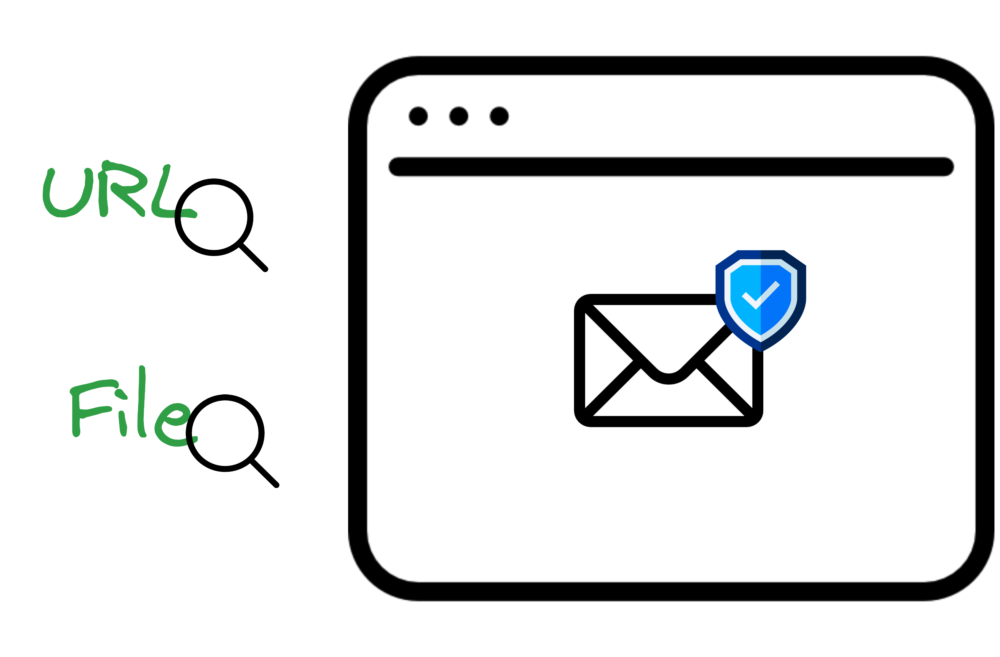

📚 **內容詳細說明：**

#### 1. 電子郵件網路釣魚防護工具和技術
#### 電子郵件過濾器

- Gmail 和 Outlook：

  這些現代電子郵件服務提供商都有內置的網路釣魚檢測功能，可以自動過濾和標記網路釣魚郵件。

  - Gmail 會自動標記可疑的郵件，並提供警告提示，大概擋掉大部分的釣魚郵件。
  有時警告沒出現還是要多注意

    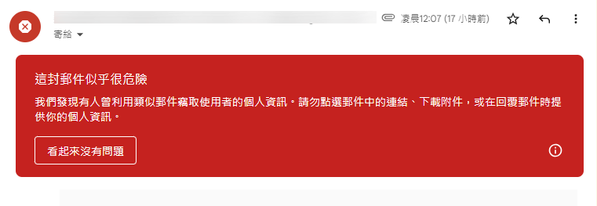

  - 其中它使用也啟動服務是  *Brand Indicators for Message Identification (BIMI)* 郵件識別品牌指標如下圖：
    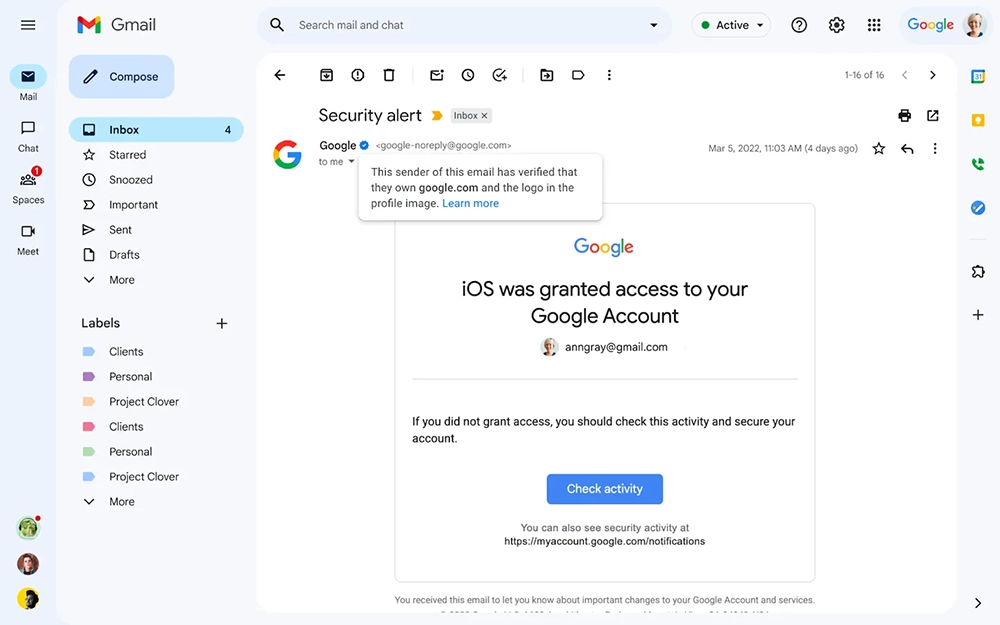
    可以看一下怎麼設置：[Gmail BIMI](https://support.google.com/a/answer/10911320?hl=zh-Hant&ref_topic=9061731&sjid=1381437160792859212-AP&visit_id=638581844212521113-2926969406&rd=1)
    雖然有藍標識基本上是安全的，**但是還是要小心，因為有時候駭客會偽裝成真的品牌。**

  - Outlook 也有類似的功能，可以自動檢測和標記網路釣魚郵件，並提供警告提示。

    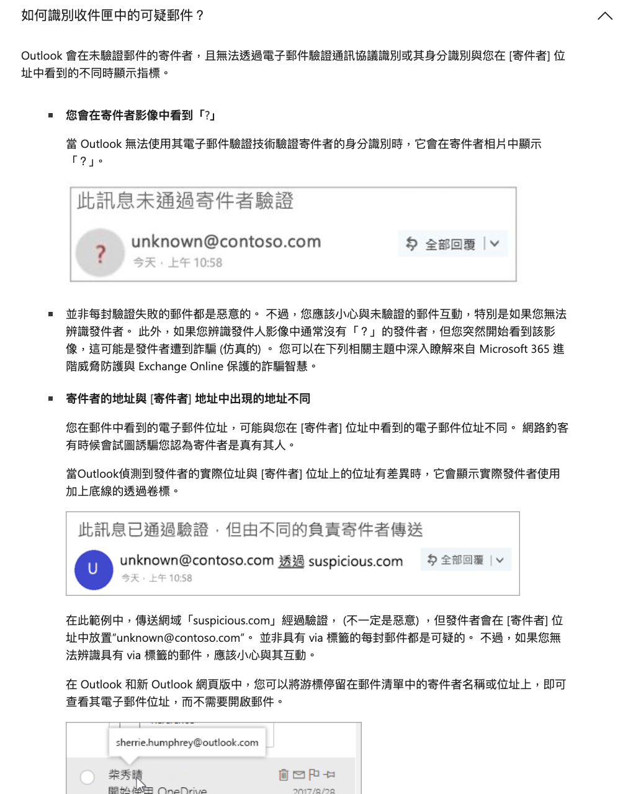
    [參考](https://support.microsoft.com/zh-tw/office/%E7%B6%B2%E8%B7%AF%E9%87%A3%E9%AD%9A%E5%92%8C%E5%8F%AF%E7%96%91%E8%A1%8C%E7%82%BA-0d882ea5-eedc-4bed-aebc-079ffa1105a3)

  - Outlook 也很多使用滑鼠就可以看的功能，如下截圖
      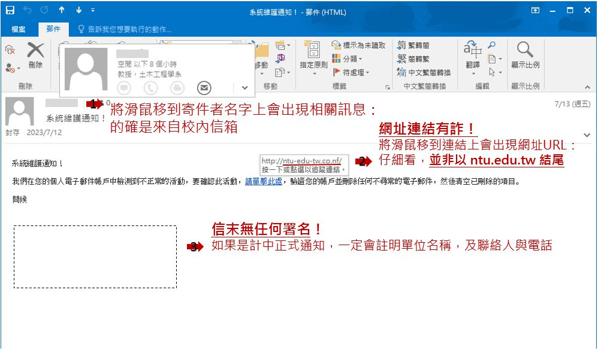
      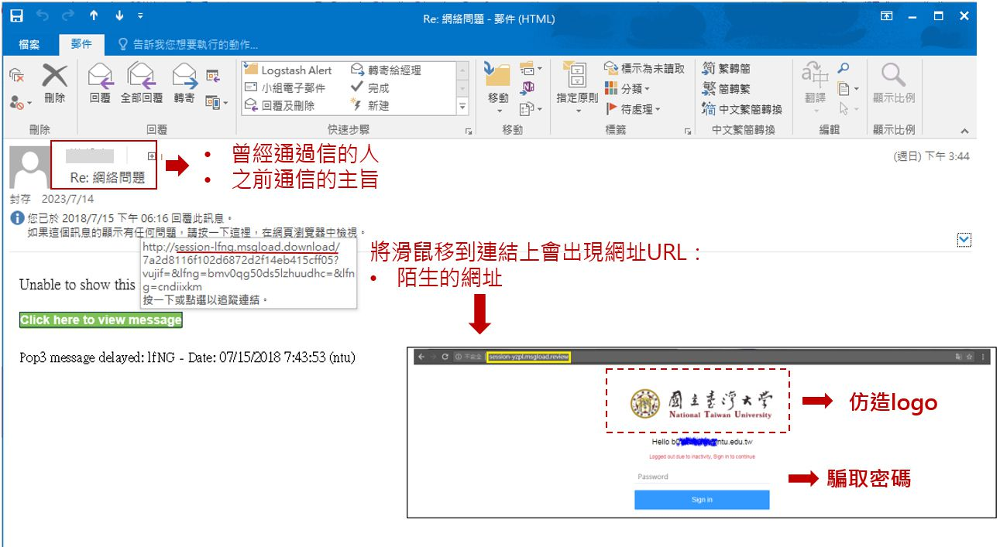
      [來源](https://www.cc.ntu.edu.tw/mailtips/index.html)

#### 多因素驗證（MFA）
  - 通過啟用多因素認證，可以增加一個額外的安全層，即使攻擊者獲取了用戶的密碼，也難以訪問帳戶。最常使用的就是 2FA，這是一種基於密碼和其他因素（如短信驗證碼、硬件密鑰、e-mail等）的驗證方式。

#### 2. 網路釣魚網站檢測工具和技術

**瀏覽器安全功能**

- **Google Safe Browsing**：這項免費服務保護用戶免受魚叉式網路釣魚網站和惡意網站的攻擊。現代瀏覽器(chrome)通常**內建**了這項功能，可以自動檢測和警告用戶關於可疑網站。

  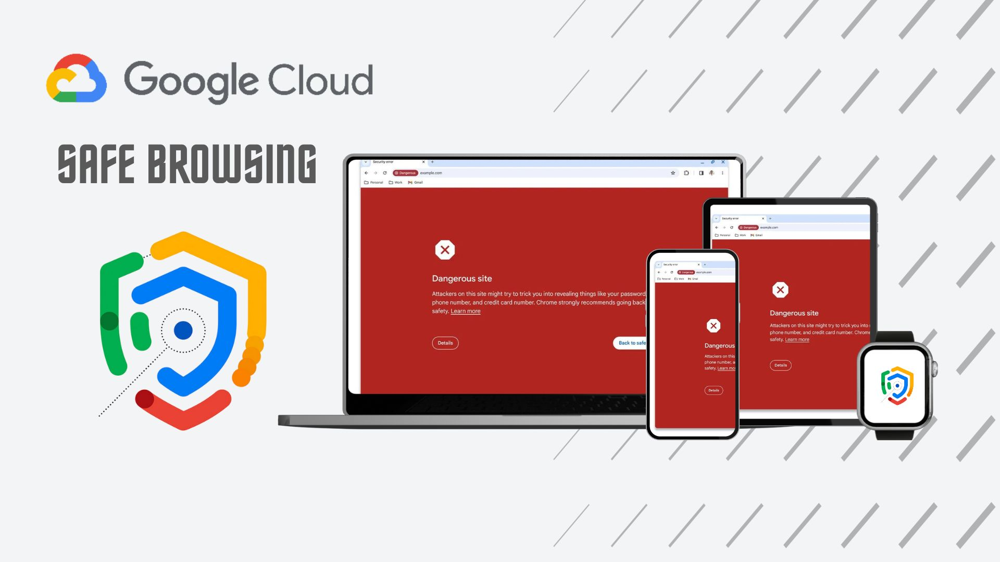
  [詳細產品功能](https://safebrowsing.google.com/)

  [文章](https://support.google.com/chrome/answer/9890866?hl=en&co=GENIE.Platform%3DDesktop&oco=0)

**反網路釣魚瀏覽器擴展**

- **Netcraft Extension**：提供瀏覽器擴展，幫助用戶檢測網路釣魚網站，並提供網站信譽評級和其他安全信息。

  [安裝套件 chrome](https://chromewebstore.google.com/detail/netcraft-extension/bmejphbfclcpmpohkggcjeibfilpamia)

  
  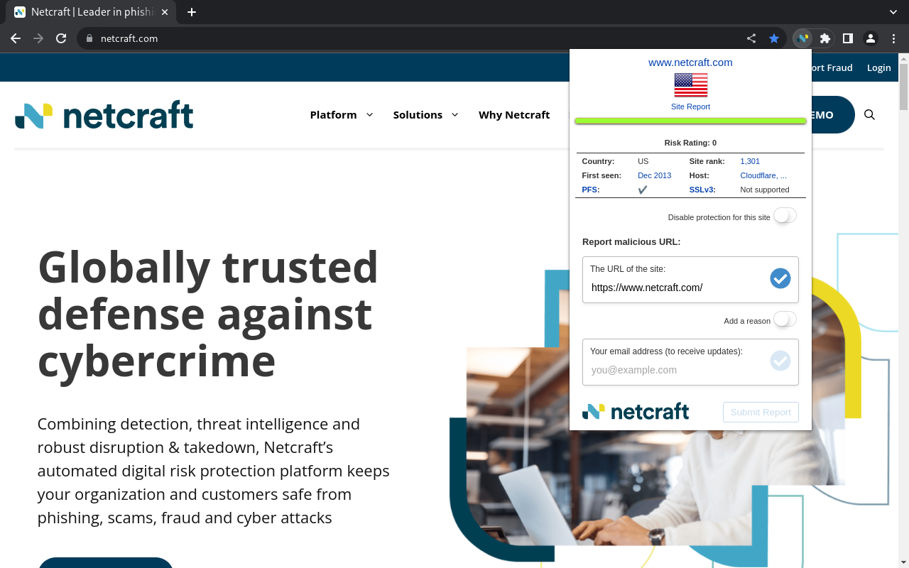
  圖片中 Site rank：網站評級還有其他豐富的訊息，可以參考一下。

  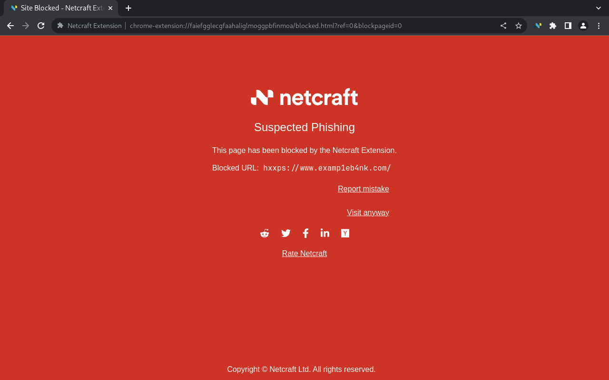
  當然它也有提供自動阻擋功能

**在線檢查工具**

- **VirusTotal**：一個免費服務，允許您掃描可疑文件和網址以檢測病毒、蠕蟲、木馬以及各種惡意軟體，包括魚叉式網路釣魚郵件中的惡意鏈接。

  提供了一個簡單的**上傳文件**或**網址的界面**，然後它會自動掃描並提供有關文件或網址的安全性報告。

  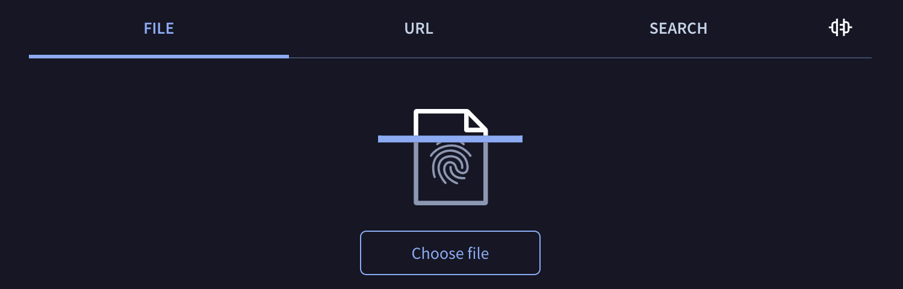
  [連結](https://www.virustotal.com/gui/home/upload)

  [教學](https://william8510.pixnet.net/blog/post/576348312)

- **PhishTank**：一個在線社區，用戶可以提交和共享網路釣魚網站的信息，並幫助其他用戶識別和阻止這些網站。

  [連結](https://phishtank.org/)

  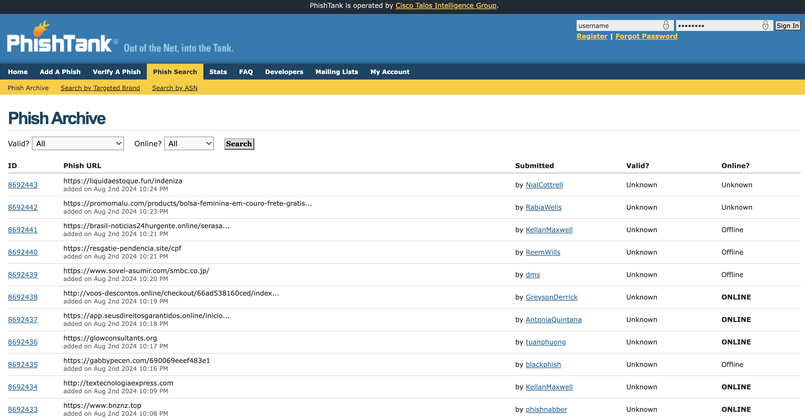

- **URLVoid**：一個在線服務，可以分析和檢查可疑的網址，提供有關網站安全性、聲譽和歷史記錄的信息。

  [連結](https://www.urlvoid.com/)

- **haveibeenpwned**：一個在線服務，用戶可以檢查自己的電子郵件地址是否曾經被泄露或出現在數據洩露事件中。

  [連結](https://haveibeenpwned.com/)

  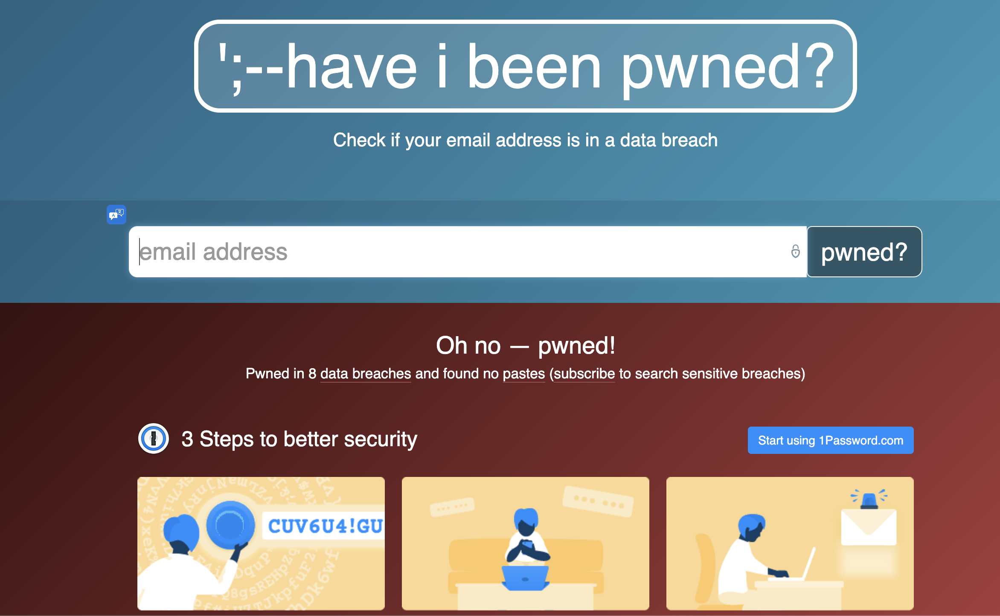
  如果看到這個畫面，就要小心了，因為你的帳號可能已經被駭客入侵了，**趕快換密碼**！

💡 學習目標：
  - 了解和使用各種電子郵件網路釣魚防護工具和技術。
  - 掌握檢測和防範網路釣魚網站的方法。

---

💓❤🧡💛💚💙💜💖 感謝您的觀看。

🙏 敬請分享與訂閱

# 🙋‍♂️ 萬分感謝！👍👍👍

[上一章](./Day4-Web2%20釣魚攻擊案例研究.md) Day4-Web2 釣魚攻擊案例研究

[下一章](./Day6-Web2與Web3%20釣魚攻擊比對.md) Day6-Web2與Web3 釣魚攻擊比對

[返回目錄](./README.md)