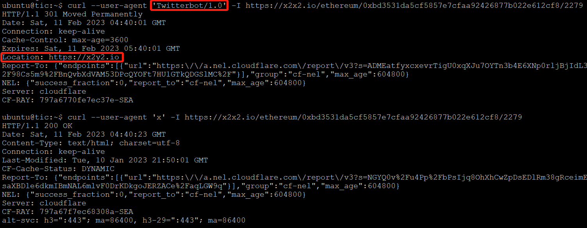

### Web3 釣魚案例分析-假冒錢包或項目方釣魚攻擊類型

🌐 **Web3 釣魚案例分析-假冒錢包或項目方釣魚攻擊類型**

>在 Web3 環境中，假冒錢包或項目方釣魚攻擊是一種常見且高效的攻擊手段。
攻擊者通過創建與真實錢包應用高度相似的假冒網站或應用，
誘騙用戶的授權或下載假冒錢包來使用，從而竊取用戶的私鑰和加密貨幣。

#### 假冒錢包或項目方釣魚攻擊詳述
1. 假冒網站
攻擊者設計與官方錢包網站幾乎相同的網頁，誘導用戶輸入私鑰或助記詞，從而獲取用戶的加密資產。

💥 攻擊手法：

攻擊者通常會利用`釣魚郵件`或`社交媒體廣告`來推廣這些假冒網站。

這些網站的設計幾乎與真實網站一模一樣，目的是讓用戶放鬆警惕，誤以為自己正在訪問官方網站，然後誘使你去操作錢包相關動作，竊取授權或私鑰。

案例 (一)
---
#### 2024年 Puffer Finance 因實行質押活動開始出現釣魚網站可以從網址很明顯看到

🔦 深入分析：

正常：https://quest.puffer.fi/home

釣魚網址：`https://quest.pufffer.fi/home`

案例(二)
---
#### 2024 年知名項目 Compound 網域 DNS 被挾持，用戶在訪問 Compound 網站時被重定向到惡意網站。

🔦 深入分析：

這裡先補充一下 [DNS 狹持說明](https://www.cloudflare.com/zh-tw/learning/security/global-dns-hijacking-threat/)

domain: compound.finance -> `compound-finance.app` (惡意網站)

被劫持的網域原本註冊於Google Domains，後來因資產購買協議被強制轉移到Squarespace。 Squarespace在遷移過程中關閉了多因素認證(F2A)，這可能是攻擊成功的原因之一。

案例(三）
---
#### FTX 提領索賠釣魚郵件

🔦 深入分析：

2023 年至 FTX 倒閉後時不時會有釣魚郵件出現，該郵件聲稱用戶可以通過點擊鏈接來拿回你失去的資產，實際上這些鏈接將用戶重定向到惡意網站，從而竊取用戶的私鑰和加密貨幣。

其中有一種比較特殊的案例，多位 FTX 用戶皆收到了假冒索賠代理公司 Kroll 的詐騙郵件，其顯示寄件者為「Kroll Udates」，在郵件標題聲稱 FTX 已全面「開放資產提領索賠」。

但其實`起因是 Kroll 在日前曾遭遇網路安全事件，導致洩露破產案中某些申索人的非敏感客戶資料`。

案例(四)
---
#### 2023 年 USDC脫鉤事件，事件發生後出現的釣魚

🔦 深入分析：

源由：

`3/8`美國矽谷銀行(SVB)宣布售出價值210億美元的資產，並認列18億美元巨額投資虧損，並宣布將增資22.5億美元，用來改善資產負債表，種種大動作引發市場恐慌，造成矽谷銀行大量擠兌，光是`3/9`一天內就被擠兌了420億美金。

最後美國矽谷銀行在 `3/10` 無預警宣布倒閉，許多公司都是在一覺醒來後發現矽谷銀行的分行以停止付款和存款，甚至有許多企業都將大量資金存在矽谷銀行，美金穩定幣USDC的發行商Circle就是其中之一。

據說有 Circle 有 33 億美金卡在矽谷銀行，`3/11` USDC 一度與美金價格脫鉤。
`3/13` 聯準會橫空出世，宣布將對矽谷銀行進行救助。

Circle存在矽谷銀行內的33億美元將可以正常提出，除了向大眾公告USDC100%安全，還宣布恢復用戶USDC的提款，USDC也隨之價格回升。

一切看是沒問題，但是.... 🌚 開始有詐騙集團趁著 USDC 開始回溫，做了個”活動“，如圖

可以看到紅色部分，circle.com 這網址的確是 Circle 官方網站。點進去確會到  reserve-circle.com 的這個網站...。 到底為什麼會這樣呢？

其實他是欺騙 twitter
如果 User-Agent 值是 Twitterbot/1.0，則跳到真實的網域；如果不是，則不做跳轉，直接輸出釣魚內容

下列是範例：

案例(5)
---
#### CoinBase 釣魚

🔦 深入分析：

  利用手機呈現 url 的部分來掩蓋呈現如下兩張圖

  

  

2. 假冒應用
在應用商店上架惡意錢包應用，誘騙用戶下載和使用，從而竊取用戶的私鑰和加密貨幣。

💥 攻擊手法：

攻擊者會創建偽裝成合法錢包應用的惡意應用，並在 Google Play 商店、 Apple App Store 上架或第三方平台上架。

用戶下載並安裝這些應用後，應用會要求他們輸入私鑰或助記詞，然後將這些信息傳送給攻擊者。

案例 (一)
---
#### 2023 年，Atomic Wallet 有疑似第三方仿冒 APP

🔦 深入分析：

False:

True:

案例 (二)
---
#### 2023 年，第三方應用程式商店上架假錢包應用或假 Twitter

🔦 深入分析：

1. 用戶在第三方應用商店下載假錢包應用。
2. 用戶輸入私鑰或助記詞。
3. 攻擊者獲取用戶的私鑰和加密貨幣。
4. 💀

總結：
---

其實不難發現，所以有的釣魚都是要讓你透過交互操作（一堆前戲），一步一步讓你掉到陷阱裡，

可以看一下 DeFiHackLabs 的小夥伴精心整理的交易流程圖大概就可以了解了。

最終的目標就是竊取你的資產，然後就會有很多哀嚎。下一章節的攻擊類型，就是釣魚之後，點擊之後的一些細節。

💡 **學習目標：**
- 理解 Web3 環境中假冒錢包或項目方釣魚攻擊的特點和手法。
---

💓❤🧡💛💚💙💜💖 感謝您的觀看。

🙏 敬請分享與訂閱

# 🙋‍♂️ 萬分感謝！👍👍👍

[上一章](/Day7-Web3%20釣魚攻擊類型.md) Day7-Web3 釣魚攻擊類型

[下一章](/Day9-Web3%20釣魚案例分析(二).md) Day9-Web3 釣魚案例分析(二)

[返回目錄](./README.md)