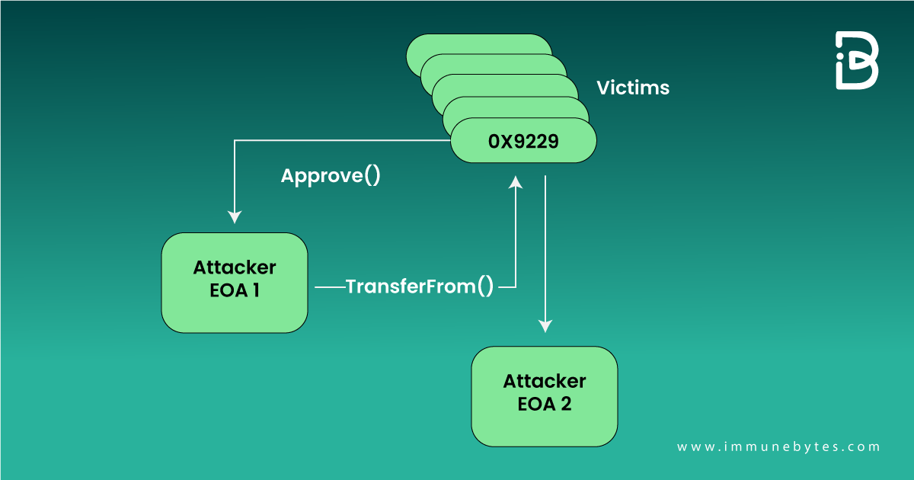
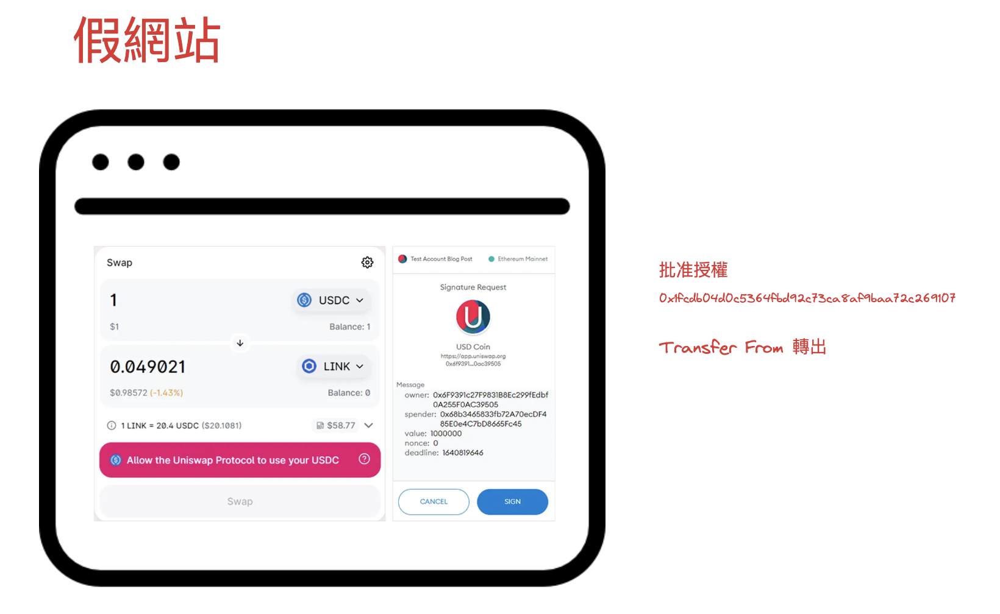
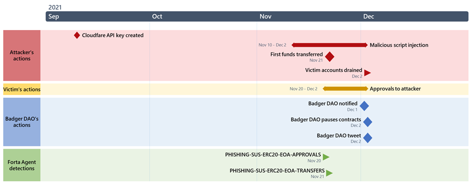
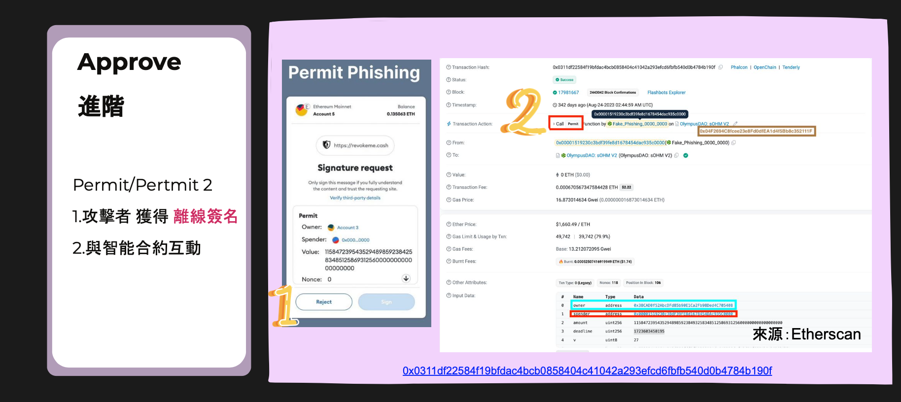
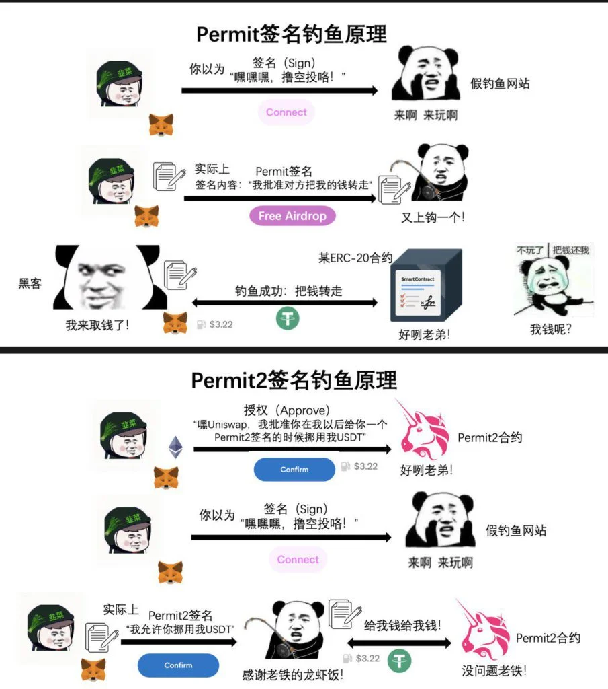
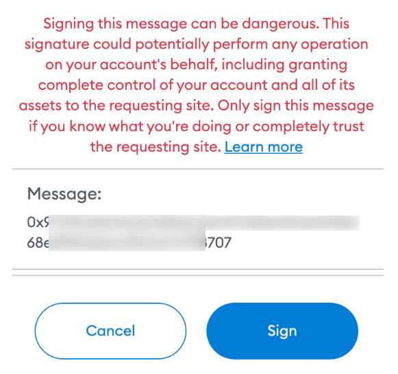
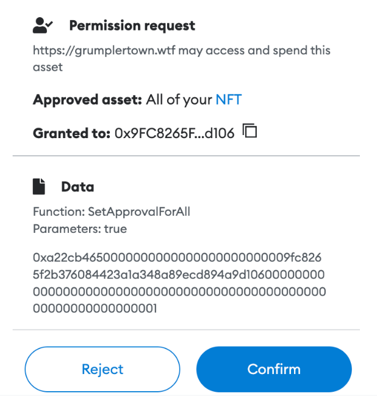

### Web3 釣魚案例分析-智能合約授權行釣魚攻擊

🌐 **Web3 釣魚案例分析-智能合約授權行釣魚攻擊**

>上一章節說到精心策劃了（前戲）之後，這個章節要說的是點擊之後會有哪些攻擊手法。

#### 智能合約授權行釣魚攻擊詳述

#### 假冒智能合約授權 (Ice Phishing)

💥 攻擊手法：

攻擊者通過釣魚手段，誘導用戶授權惡意智能合約，從而竊取用戶的資產。

案例 (一)
---
#### 2022 年 12 月 17 日，駭客從昂貴且著名的 Bored Apes Yacht Club (BAYC) 收藏中盜走了 14 個 Bored Apes (NFT)。

🔦 深入分析：

一名投資者被說服簽署了一份偽裝成"電影合約的交易請求"，讓騙子可以將用戶的所有猿類以微薄的價格出售給自己。

以下是過程，Approve 攻擊合約 TransferFrom 轉移



案例 (二)
---
#### 2021年 Badger DAO 攻擊者從 200 個帳戶竊取了 1.21 億美元的比特幣

🔦 深入分析：

黑客利用了 BadgerDAO 的網站和 DNS 服務器的漏洞，將其劫持並重新導向到一個偽造的網站。

部署惡意合約地址 0x1fcdb04d0c5364fbd92c73ca8af9baa72c269107

讓使用者授權合約，並從用戶錢包中竊取資產。如下圖



時間過程：




#### 2.Permit 鏈下簽名釣魚

💥 攻擊手法：
Permit 鏈下簽名釣魚攻擊是指攻擊者利用用戶在鏈下進行的簽名授權操作來竊取資產。

補充一下鏈下簽名：

其功能就是用戶不用事先授權，通過一個附加簽名(permit)的方式，直接在合約中進行交易。
其中這個機制是 EIP-2612 被引入到 ERC20

也就是說.. 有簽名就可ㄧ直進行交易，不用再次授權。

```
permit 函數有 7 個參數：
{
  owner：被授權的地址
  spender：授權給誰
  value：授權給定的代幣數量 （這裡有些人偷懶直接用無限大，非常不建議）
  deadline：時間戳，給定有效時間（也非常不建議設到很大力如 999. 天）
  v, r, s：簽名數據
}
```
案例

https://etherscan.io/tx/0x0311df22584f19bfdac4bcb0858404c41042a293efcd6fbfb540d0b4784b190f




雖然獲取離線簽章很方便交易，但是也有風險，這個案例就是一個很好的例子。

permit 補充：



[來源](https://www.blocktempo.com/vernacular-interpretation-of-the-underlying-logic-of-web3-signature-phishing/)


#### 3.eth_sign 釣魚

💥 攻擊手法：
利用 RPC 提供的 eth_sign 方法，誘導用戶簽署惡意數據，從而竊取用戶的資產，現在大部分的錢包都有支援警示這個方法。

如果出現以下的畫面請特別注意，不要隨意簽名。



正常的簽名因該會是類似這個樣子




總結：
---

因為安全性所出現的授權機制，駭客會努力建議漂亮的糖果屋，讓你一步一步的...。而因為便捷性而出現的簽名機制，也讓駭客有了更多的機會，或許 UI/UX 也是個問題，但只能多加小心理解這些機制，才不會掉進陷阱。


💡 **學習目標：**
- 理解授權類型的釣魚攻擊手法


💓❤🧡💛💚💙💜💖 感謝您的觀看。

🙏 敬請分享與訂閱

# 🙋‍♂️ 萬分感謝！👍👍👍

[上一章](./Day8-Web3%20釣魚案例分析.md) Day8-Web3 釣魚案例分析

[下一章]()